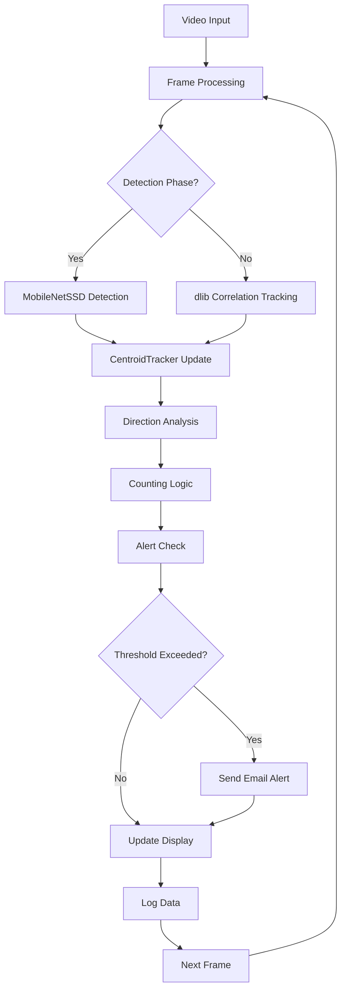

# Real-Time People Counting System - Technical Documentation

## Project Overview

This is a sophisticated real-time people counting system designed for business applications, particularly useful for monitoring foot traffic in stores, buildings, shopping malls, and other commercial spaces. The system provides automated counting, alerting, and logging capabilities with real-time performance optimization.

## Architecture Overview

The system follows a modular architecture with clear separation of concerns:

```
real_time_people_couting/
├── detector/                    # Pre-trained MobileNetSSD model files
│   ├── MobileNetSSD_deploy.caffemodel
│   └── MobileNetSSD_deploy.prototxt
├── tracker/                     # Object tracking algorithms
│   ├── centroidtracker.py      # Centroid-based tracking implementation
│   └── trackableobject.py      # Trackable object data structure
├── utils/                       # Utility modules and configuration
│   ├── config.json             # System configuration
│   ├── mailer.py               # Email alert functionality
│   ├── thread.py               # Multi-threading implementation
│   └── data/                   # Data storage and logs
│       ├── logs/
│       │   └── counting_data.csv
│       └── tests/
│           └── test_1.mp4
├── people_counter.py           # Main application entry point
├── requirements.txt            # Python dependencies
└── README.md                   # Basic usage instructions
```

## Core Components

### 1. Object Detection (MobileNetSSD)

**Location**: `detector/` directory

The system uses MobileNetSSD (Single Shot Detector) for real-time person detection:

- **Model**: Pre-trained Caffe model optimized for mobile/embedded devices
- **Classes**: Detects 21 object classes including "person" (class index 15)
- **Performance**: Optimized for speed while maintaining accuracy
- **Input**: RGB frames resized to 500px width for processing efficiency

**Key Features**:
- Single-shot detection (no region proposal step)
- MobileNet backbone for efficiency
- Confidence threshold filtering (default: 0.4)
- Skip frame optimization (default: every 30 frames)

### 2. Object Tracking System

#### CentroidTracker (`tracker/centroidtracker.py`)

Implements a robust centroid-based tracking algorithm:

```python
class CentroidTracker:
    def __init__(self, maxDisappeared=40, maxDistance=50):
        # Configuration parameters
        self.maxDisappeared = maxDisappeared  # Max frames before deregistration
        self.maxDistance = maxDistance        # Max distance for association
```

**Core Algorithm**:
1. **Registration**: Assigns unique IDs to new detections
2. **Association**: Matches centroids using Euclidean distance
3. **Tracking**: Updates existing object positions
4. **Deregistration**: Removes objects that disappear for too long

**Key Methods**:
- `register(centroid)`: Assigns new object ID
- `deregister(objectID)`: Removes tracked object
- `update(rects)`: Main tracking update loop

#### TrackableObject (`tracker/trackableobject.py`)

Simple data structure for maintaining object state:

```python
class TrackableObject:
    def __init__(self, objectID, centroid):
        self.objectID = objectID
        self.centroids = [centroid]  # Historical positions
        self.counted = False         # Counting status
```

### 3. Main Application Logic (`people_counter.py`)

The main application orchestrates all components and implements the counting logic:

#### Key Functions

**`parse_arguments()`**
- Handles command-line arguments
- Configures model paths, confidence thresholds, and skip frames

**`people_counter()`**
- Main application loop
- Integrates detection, tracking, and counting
- Manages video input/output

**`send_mail()`**
- Triggers email alerts when threshold exceeded
- Runs in separate thread to avoid blocking

**`log_data()`**
- Exports counting data to CSV format
- Includes timestamps for analysis

#### Counting Algorithm

The system implements a sophisticated counting mechanism:

1. **Detection Phase**: Runs MobileNetSSD every N frames (default: 30)
2. **Tracking Phase**: Uses dlib correlation tracker for intermediate frames
3. **Direction Analysis**: Determines movement direction based on centroid history
4. **Counting Logic**:
   - **Entry**: Person crosses center line moving down (positive Y direction)
   - **Exit**: Person crosses center line moving up (negative Y direction)
   - **Current Count**: `total_entries - total_exits`

#### Visual Elements

- **Center Line**: Horizontal line dividing the frame
- **Object IDs**: Unique identifiers for each tracked person
- **Centroids**: White circles showing object centers
- **Status Display**: Real-time counting information
- **Alert Messages**: Visual warnings when threshold exceeded

### 4. Utility Modules

#### Configuration Management (`utils/config.json`)

```json
{
    "Email_Send": "",           # Sender email address
    "Email_Receive": "",        # Recipient email address
    "Email_Password": "",       # Email password/app password
    "url": "",                  # Video source URL (0 for webcam)
    "ALERT": false,             # Enable email alerts
    "Threshold": 10,            # Maximum people limit
    "Thread": false,            # Enable multi-threading
    "Log": false,               # Enable data logging
    "Scheduler": false,         # Enable scheduled execution
    "Timer": false              # Enable automatic timer
}
```

#### Email Alert System (`utils/mailer.py`)

```python
class Mailer:
    def __init__(self):
        self.server = smtplib.SMTP_SSL('smtp.gmail.com', 465)
    
    def send(self, mail):
        # Sends alert email when people limit exceeded
```

**Features**:
- Gmail SMTP integration
- SSL encryption
- Asynchronous execution
- Customizable alert messages

#### Multi-Threading (`utils/thread.py`)

```python
class ThreadingClass:
    def __init__(self, name):
        self.q = queue.Queue()
        # Separate thread for frame reading
    
    def _reader(self):
        # Continuously reads frames into queue
        # Removes OpenCV's internal buffer
```

**Benefits**:
- Reduces frame lag
- Improves real-time performance
- Eliminates OpenCV buffer delays
- Better resource utilization

## Data Flow Architecture



## Performance Optimizations

### 1. Skip Frame Strategy
- Runs expensive detection every 30 frames
- Uses fast correlation tracking for intermediate frames
- Balances accuracy with performance

### 2. Multi-Threading
- Separate thread for frame reading
- Eliminates OpenCV internal buffer
- Reduces latency and improves FPS

### 3. Frame Resizing
- Resizes input to 500px width
- Reduces computational load
- Maintains detection accuracy

### 4. Memory Management
- Efficient object registration/deregistration
- Automatic cleanup of disappeared objects
- Minimal memory footprint

## Configuration Options

### Video Sources
- **Webcam**: Set `"url": 0`
- **IP Camera**: Set `"url": "http://ip:port/video"`
- **Video File**: Use `--input` command line argument

### Alert System
- **Email Configuration**: Gmail SMTP with app passwords
- **Threshold Setting**: Configurable people limit
- **Real-time Alerts**: Immediate notification when exceeded

### Scheduling
- **Daily Execution**: Runs at specified times
- **Timer Control**: Automatic shutdown after set duration
- **Business Hours**: Configurable for operational needs

### Logging
- **CSV Export**: Structured data for analysis
- **Timestamp Tracking**: Precise entry/exit times
- **Footfall Analysis**: Historical data for business insights

## Usage Examples

### Basic Webcam Usage
```bash
python people_counter.py --prototxt detector/MobileNetSSD_deploy.prototxt --model detector/MobileNetSSD_deploy.caffemodel
```

### Video File Processing
```bash
python people_counter.py --prototxt detector/MobileNetSSD_deploy.prototxt --model detector/MobileNetSSD_deploy.caffemodel --input utils/data/tests/test_1.mp4
```

### High-Performance Configuration
```json
{
    "Thread": true,
    "ALERT": true,
    "Threshold": 15,
    "Log": true
}
```

## Technical Specifications

### Dependencies
- **OpenCV**: 4.5.5.64 (Computer vision operations)
- **NumPy**: 1.24.3 (Numerical computations)
- **dlib**: 19.24.1 (Correlation tracking)
- **imutils**: 0.5.4 (Image processing utilities)
- **scipy**: 1.10.1 (Distance calculations)
- **schedule**: 1.1.0 (Task scheduling)

### System Requirements
- **Python**: 3.11.3 (recommended)
- **Memory**: Minimum 4GB RAM
- **CPU**: Multi-core processor recommended
- **Camera**: USB webcam or IP camera

### Performance Metrics
- **FPS**: 15-30 frames per second (depending on hardware)
- **Accuracy**: 90%+ under good lighting conditions
- **Latency**: <100ms with threading enabled
- **Memory Usage**: <500MB typical

## Business Applications

### Retail Analytics
- Customer flow analysis
- Peak hour identification
- Store layout optimization
- Staff scheduling

### Security Monitoring
- Occupancy limits enforcement
- Unauthorized access detection
- Emergency evacuation monitoring
- Compliance reporting

### COVID-19 Compliance
- Social distancing enforcement
- Capacity management
- Contact tracing support
- Health safety monitoring

## Troubleshooting

### Common Issues

1. **Low FPS Performance**
   - Enable threading: `"Thread": true`
   - Reduce skip frames: `--skip-frames 15`
   - Lower resolution input

2. **Detection Accuracy**
   - Improve lighting conditions
   - Adjust confidence threshold: `--confidence 0.3`
   - Ensure clear camera positioning

3. **Email Alerts Not Working**
   - Verify Gmail app password
   - Check network connectivity
   - Confirm email configuration

4. **Memory Issues**
   - Reduce maxDisappeared parameter
   - Enable automatic cleanup
   - Monitor system resources

## Future Enhancements

### Potential Improvements
- **Deep Learning Tracking**: Replace centroid tracker with deep learning models
- **Multi-Camera Support**: Synchronized counting across multiple cameras
- **Cloud Integration**: Real-time data streaming to cloud platforms
- **Mobile App**: Remote monitoring and control interface
- **Analytics Dashboard**: Advanced reporting and visualization
- **Edge Computing**: Optimized for embedded devices

### Scalability Considerations
- **Horizontal Scaling**: Multiple camera feeds
- **Vertical Scaling**: Enhanced hardware utilization
- **Cloud Deployment**: Containerized solutions
- **API Integration**: RESTful services for external systems

## Security Considerations

### Data Privacy
- Local processing (no cloud data transmission)
- Configurable data retention policies
- Secure email communication (SSL/TLS)
- Access control for configuration files

### System Security
- Input validation for configuration
- Secure credential storage
- Network security for IP cameras
- Regular security updates

## Conclusion

This real-time people counting system provides a robust, scalable solution for business applications requiring accurate foot traffic monitoring. The modular architecture, performance optimizations, and comprehensive feature set make it suitable for various commercial and security applications.

The system's strength lies in its balance of accuracy and performance, making it practical for real-world deployment while maintaining the flexibility to adapt to different business requirements and operational constraints.
